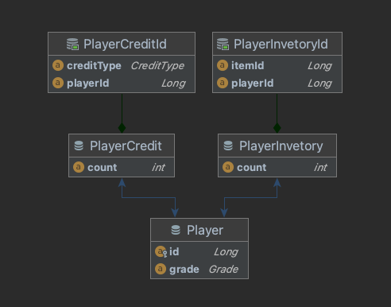

# 🕹 Naver Zepeto Craft

## 1. 개발환경

- SpringBoot : v2.5.0
- Spring Data JPA
- Java : 1.8
- DB : H2
- Git
    - Git-Flow는 단순화하여 `master`-`feature` 브랜치를 적용
    - merge는 non-fast-forward `--no-ff` 명령어 적용통해 merge commit 남김

## 2. API 목록

### 🎮 재화 충전 API

#### 요구사항

1. Request : 플레이어 ID, 충전될 유상 재화량, 충전될 무상 재화량
1. 충전
    1. 플레이어의 잔고에 추가, DB에 저장
1. 응답
    - 플레이어의 잔고 총액(유상/무상 구분 ❌)

#### 제약 및 고려사항

1. 재화는 `유상`과 `무상` 두 가지 존재
2. 무상 재화의 획득 경로 다양함 : 퀘스트, 이벤트 참여 등

### 🎮 아이템 구매 API

#### 요구사항

1. Request : 플레이어 ID, 아이템 ID, 구매 개수
1. 구매 처리
    1. 아이템 가격만큼 재화 차감 : `재화 소진 정책` 적용(**확장 가능성 고려**)
    2. 아이템 인벤토리 추가
        1. 기소유 아이템 시 보유량 증가
        3. 무소유 아이템 시 인벤토리 신규 추가
    2. 잔고 부족시 구매 요청 **실패**
1. 응답
    - 구매 성공/실패 여부 : 살패 사유는 응답에서 제외

#### 제약 및 고려사항

1. 재화 >= 0
2. 아이템 구조 : ID, 가격
3. 재화 소진 정책
    - 현재 정책 한가지 존재
        1. 무상 재화 먼저 소진 → 이후 유상 재화 소진
    - 정책 추가 계획 존재, **플레이어에 따라 다른 소진 정책** 적용 가능성 존재
    - 플레이어에게 재화 소진 정책은 한가지만 적용 가능. 중첩 불가

⭐️ 추가 조건 ⭐

- 아이템 정보는 DB가 아닌 하드 코딩 방식 적용
- 이력 관리는 고려하지 ❌ : 재화 충전, 아이템 구매, 재화 소진

## 3. ERD

